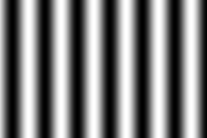
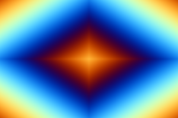

# Night of the Nerds Hydra Workshop

Maak je eigen visuele werken door je webcam, kleuren, vormen en nog veel meer samen te mixen tot een kunstwerk met eindeloze mogelijkheden.
Je hebt helemaal geen codeer ervaring nodig om ermee te beginnen. Beelden coderen met Hydra is toegankelijk voor iedereen en helemaal gratis te gebruiken rechtstreeks in je browser.

## De basis

 1. Ga naar [Hydra](https://hydra.ojack.xyz/) in je internet browser
 2. Druk op X op het popup venster te sluiten, maak dan het canvas leeg met de prullenbak knop
 3. Begin met een bron, bijvoorbeeld `osc(40,0.1,0)`
 4. Op het eind van de code schrijf je `.out(o0)`
 5. Om je code `osc(40,0.1,0).out(o0)` te activeren druk je op de play knop 


 
Gefeliciteerd! Nu kun je beginnen met experimenteren door de cijfers aan te passen en transformaties toe te voegen.


## Code voorbeelden

#### Kaleidoscoop
Deze transformatie voegt een kaleidoscoop effect toe aan je bron

```javascript
osc(10,0.1,1).kaleid(4).out(o0)
```


### Tips
- Bij decimale getallen gebruik je een punt in plaats van komma. Dus 1.5 en niet 1,5
- Pas de volgorde van je transformaties eens aan 
- Code kun je ook uitvoeren door ctrl+shift+enter in te drukken

### Error

Wat te controleren als je code niet werkt

- Heb je typfouten gemaakt?
- Begint je code met een bron?
- lege regels? zorg dat de code aansluit
- Beginnen al je transformaties met een punt?
- Heb je `.out()` op het einde staan?
- Als het beeld is vastgelopen nadat je de code hebt geactiveerd; kopieer jouw code door alles te selecteren, *`ctrl-C`*, en ververs dan de browser. Klik op de prullenbak om  alles te verwijderen, plak je eigen code door *`ctrl-V`*  

---

## Bouwstenen

Hieronder staan een aantal bronnen en transformaties om je op weg te helpen. De volledige lijst is te vinden op [hydra.ojack.xyz/functions/](https://hydra.ojack.xyz/functions/)

### 1. Bron
`osc(40,0.1,0)`
`gradient(1)`
`voronoi(5,0.3,0.3)`
`noise(10,0.1)`
`shape(4,0.5,0)`
`solid(1,0,0)`

### 2. Transformaties
`.rotate(10,1)`
`.pixelate()`
`.kaleid(4)`
`.scroll()`
`.scale(0.5)`
`.colorama(0.005)`
`.color(0,1,1)`

---


